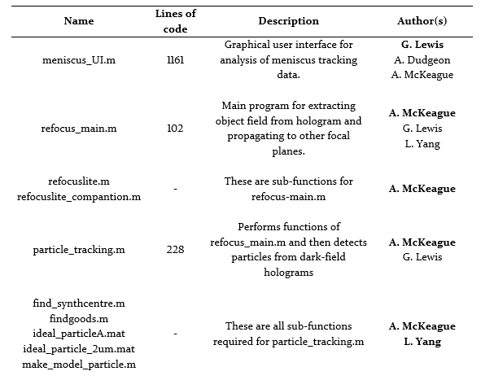

# Penetration-of-liquid-into-capillaries
Meniscus tracking and digital holography code used during my MSci project at Durham University

The code used in this project can all be accessed in an online repository* which contains the following:

Furthermore, bpass.m and pkfnd.m were used as sub-functions for particle_tracking.m, these are functions created by Blair and Dufresne, available at The Matlab Particle Tracking Code Repository
